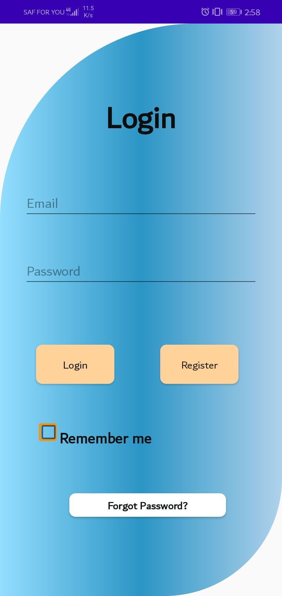
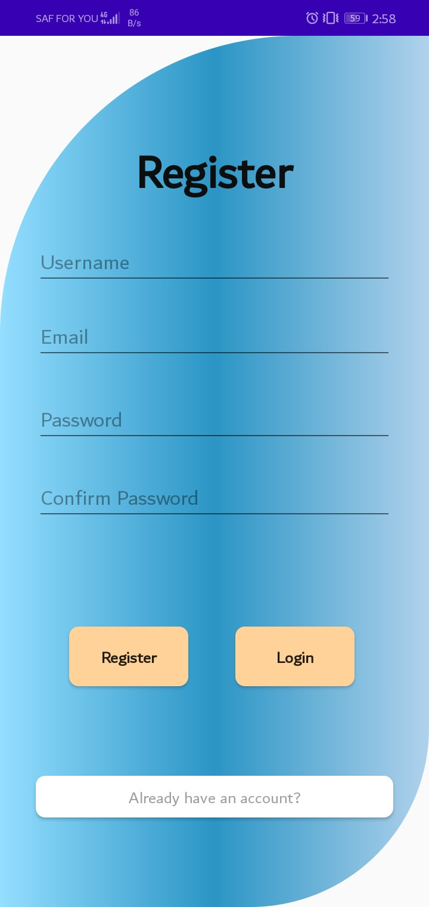
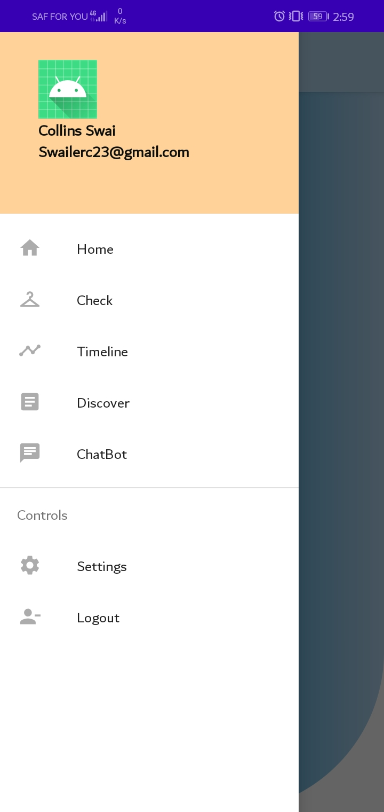

# M-HEALTH       :construction: 

# Work in Progress

Android app for improving your mental health  by tracking it daily and resource suggestions.

## What`s M-Health 

M-healths uses various behavioral and therapeutic techniques to guide people in managing their emotions and improving their state of mind. Available to smartphone users, they’re positioned as a portable, affordable and accessible way to get help with your mental health.

 ## Project Demo

